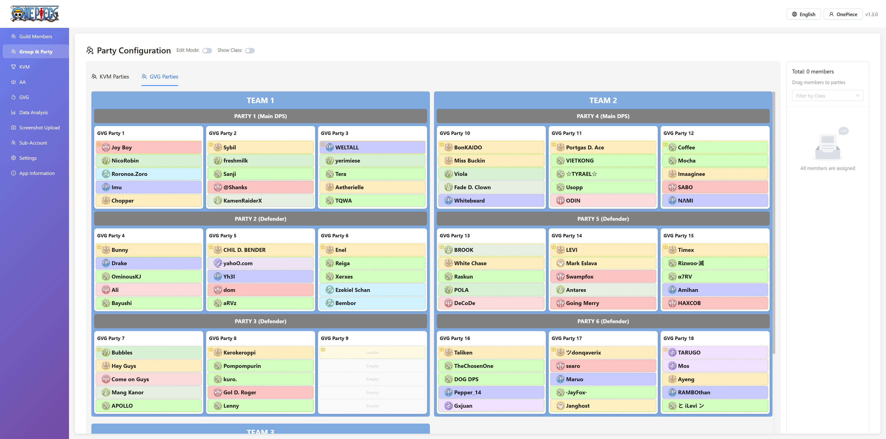

# ROX Guild Manager

A guild management web application based on React and Node.js, supporting screenshot recognition and guild member management.





## Features

### 🎯 Core Functions
- **Guild Member Management**: Add, edit, delete guild member information
- **Screenshot Recognition**: Use Tesseract OCR to recognize guild member information from game screenshots
- **Intelligent Data Processing**: Automatically parse recognition results and convert to structured data
- **Data Export**: Support JSON format export of recognition results

### 🔍 Screenshot Recognition Features
- **Multi-mode Recognition**: 
  - Normal mode: Display complete OCR recognition results
  - Guild member mode: Automatically process into guild member data structure
- **Intelligent Parsing**: Automatically recognize names, levels, roles, contribution points and other information
- **Table Recognition**: Support recognition of guild member lists in table format
- **Real-time Status**: Display OCR service status and recognition progress

### 🎨 User Interface
- **Modern Design**: Responsive interface based on Ant Design
- **Intuitive Operation**: Drag and drop upload, one-click recognition, real-time preview
- **Multi-tab Display**: Recognition results, original text, JSON output displayed in separate tabs
- **Status Indicators**: Real-time display of OCR service status and recognition results

## Tech Stack

### Frontend (Client)
- **React 18** - User interface framework
- **TypeScript** - Type safety
- **Ant Design** - UI component library
- **Vite** - Build tool
- **Axios** - HTTP client

### Backend (Server)
- **Node.js** - Runtime environment
- **Express.js** - Web framework
- **TypeScript** - Type safety
- **Tesseract.js** - OCR text recognition
- **Sharp** - Image processing
- **Multer** - File upload handling

## Quick Start

### Requirements
- Node.js 16+
- npm or yarn

### Install Dependencies
```bash
# Install root dependencies
npm install

# Install client dependencies
cd client && npm install

# Install server dependencies
cd server && npm install
```

### Start Application

#### Method 1: Use Simplified Start Script (Recommended)
```bash
# Windows
.\start-simple.bat

# Linux/Mac
./start.sh
```

#### Method 2: Start Separately
```bash
# Start server (port 3001)
cd server && npm run dev

# Start client (port 3000)
cd client && npm run dev
```

### Access Application
- Client: http://localhost:3000
- Server API: http://localhost:3001

### Deploy Application
```bash
docker-build-start.sh
```

## License

MIT License

## Contributing

Welcome to submit Issues and Pull Requests to improve this project!